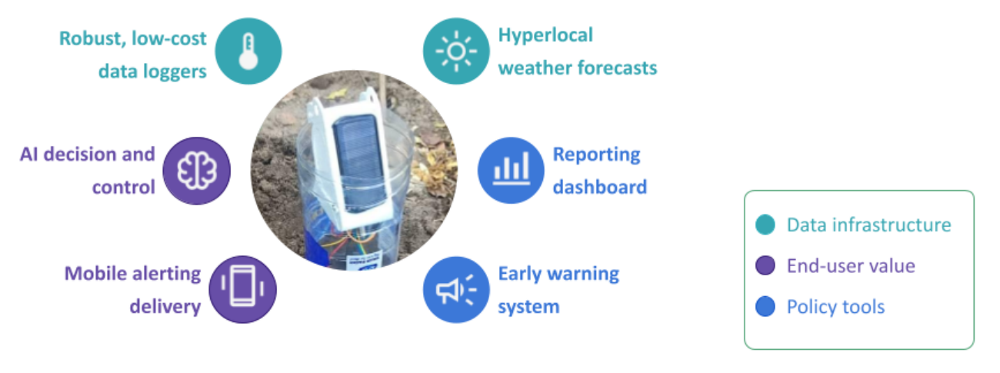

# Overview

The Climate Adaptation Data Platform (CADP) accelerates climate adaptation
initiatives by bringing together multiple stakeholders to addresss
multiple climate-related challenges.
The primary stakeholders are policymakers/governments, farmers, 
and individual members of the community.
The CADP provides tangible value to each stakeholder.

Real-time sensor networks with integrated forecasting and AI is a
complex undertaking.
It requires numerous people with specialized expertise cutting across
GIS, IOT, data science, as well as target domains like agriculture,
environment, or public health.

The magic of the CADP is that it manages this complexity to reduce
the effort required to deploy such a platform.
It also supports multiple deployment pathways to accommodate different
situations.
Forward-thinking municipalities can deploy the platform as a standalone
initiative.
Citizens can also induce action by deploying a device network
from the bottom up. 
These devices automatically plug into the public CADP instance,
which helps demonstrate the value of the device network.


```{r, echo=FALSE, fig.align='center', fig.cap="The CADP brings together critical data infrastructure with end-user advisory and policy tools to create value greater than the sum of its parts."}

```

This document discusses the different use cases that CADP is designed for
and the value people get from these use cases.
Where applicable, a distinction will be made between 
the value individuals get from the platform versus the value policymakers get.

After describing the use cases, we move into more technical territory
so people can learn how to use and develop the platform further.
First is a high-level view of the physical infrastructure and
the relationship between a device network and the CADP.
Devices are responsible for monitoring environmental conditions
and sending the collected data to the platform.
