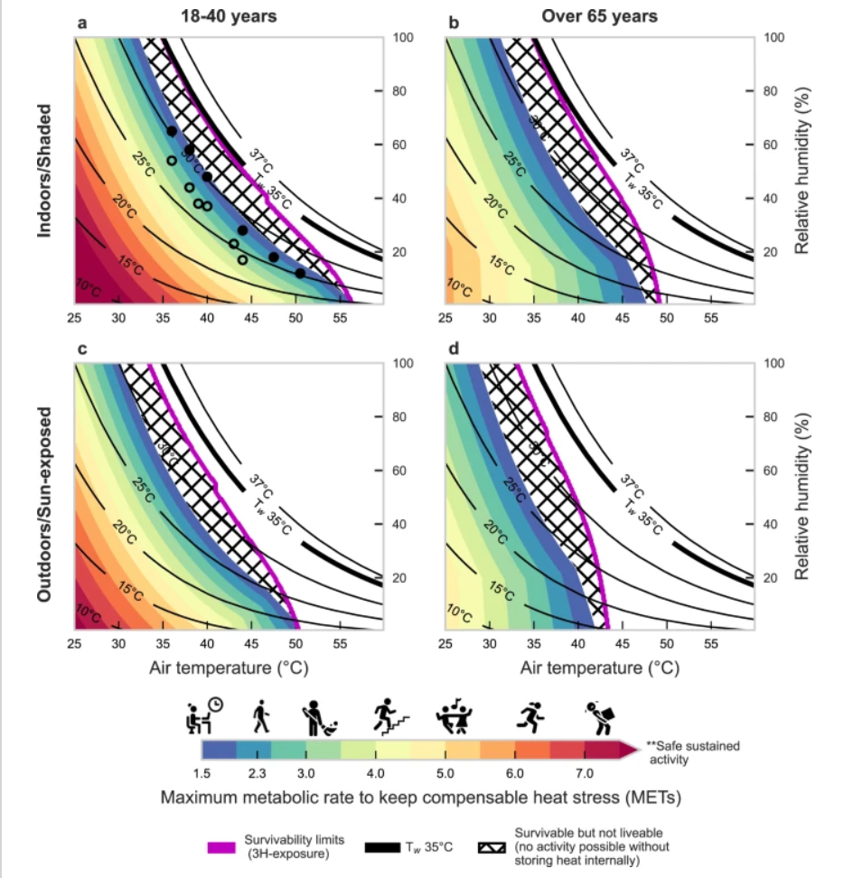
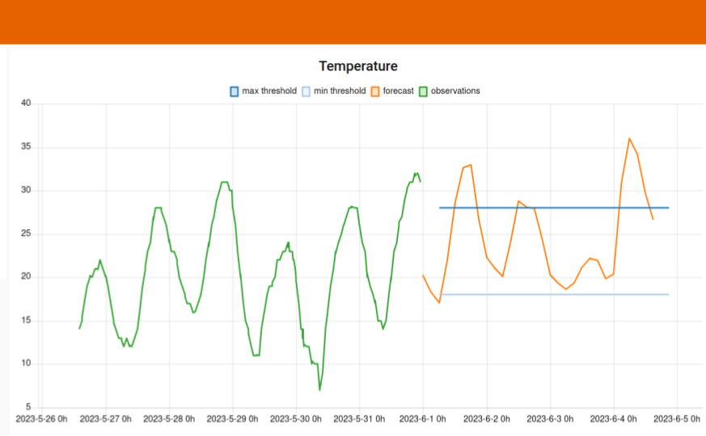

# Use Cases
Every device powers multiple simultaneous use cases.
We call this use case stacking.
This is different from re-using or re-purposing a device.
With use case stacking, multiple applications run concurrently.
The supported use cases depend on the sensors attached.
The two main public health use cases only need the base set of sensors,
which means anybody with an account can get hyperlocal heat risk
and mosquito abundance information.

\begin{figure}
\centering
\includegraphics[width=.8\linewidth]{cadp_applications}
\caption{Use case stacking enables the CADP to power multiple simultaneous applications across public health and food security.}
\label{fig:cadp_applications}
\end{figure}


\begin{tikzpicture}
\draw (0,0) circle (2cm);
\end{tikzpicture}

## Public health

### Early warning systems

The genesis of this project was the death of 11,000 people in Libya due
to a medicane (Mediterranean hurricane) that caused a dam to fail.
People were caught off guard because as a failed state,
Libya has no functioning weather agency.
It turns out that most of Africa has limited weather stations.
Most official weather agencies only send out seasonal forecasts.

Weather forecasts give people critical time to plan and prepare for
major weather events.
Building on top of weather forecasts are early warning systems (EWS).
These systems apply rules, or risk protocols, to forecasts to determine
the level of risk people are exposed to.
EWSes can operate on any type of forecast and includes heat risk,
air quality risk, the spread of wildfire,
the spread of infectious disease, and the spread of pests like the ash borer.

The UN declared a mandate that everyone should be covered by an early warning
system by 2030. Some $3 billion dollars have been earmarked for this effort.
While many countries have early warning systems, many are outdated, 
no longer work, or cover a limited number of risks.

The CADP provides the infrastructure to quickly build EWSes and fulfill
the UN's vision.

### Heat risk

Survivability is the upper limit of temperature and humidity that humans
can withstand. Humidity has a significant impact on the maximum temperature
that humans can survive in. With high humidity, the body loses its ability
to regulate temperature via perspiration.

In some places, climate change is making heat waves more extreme and pushing
temperatures to the survivability level.
Even if that limit isn't reached, whether those conditions are livable is
another matter.
Livability limits help people understand what activities are possible
given temperature and humidity (and sun exposure).
Figure \@ref(fig:livability-limits) 
compares livability limits for two population
groups and whether the activity takes place in direct sun or shade.

```{r livability-limits, echo=FALSE, fig.align='center', fig.cap="Livability limits for different METs at different temperature and humidity levels. Source: [@vanos2023]"}

```

The conversion formula between METs ($M$) and calories is
\begin{align}
M \frac{3.5 m}{200} = kcal/min,
\end{align}
where $m$ is mass in kilograms.
This formula enables us to customize the heat risk of specific activities
according to each individual and their specific health conditions.


Heat risk builds on the concept of livability. 
The goal is to provide an EWS that helps people understand their heat risk
exposure and make decisions about what activities to do or 
how to mitigate heat risk during certain activities.
As shown in \@ref(fig:cadp-ews-quebec) the platform currently highlights
risks

```{r cadp-ews-quebec, echo=FALSE, fig.align='center', fig.cap="A screenshot of a policy dashboard showing active heat risk alerts for two devices."}
knitr::include_graphics('images/cadp_ews_quebec.png')
```

Individuals can get personalized heat risk guidance for any device in CADP.
Alerts can be delivered via email or via the mobile app.
Users can enter some health information to get better alerts.
This information is saved but 
segregated from personally identifiable information (PII).

Relevant health information includes

- age
- BMI (weight + height)
- diabetes
- heart issues

We envision a conversational alert message that doubles as a daily planner.
Integrating this information with preferred activities results in specific
messaging that informs people of what activities are realistic for a given 
day. On a very hot and humid day, an older person may want to 
limit sun exposure to an hour. That might mean that golf should be avoided,
whereas a stroll through a shaded park is more appropriate.


### Mosquito-borne infectious disease

Mosquitos are a common disease vector and 
can carry numerous infectious diseases,
such as malaria, dengue fever, zika virus, yellow fever.
Disease outbreaks are driven by the growth of a mosquito population.
To limit the severity of an outbreak,
mosquito surveillance is conducted to monitor the spread of mosquitos.
By tracking mosquito abundance, it is possible to predict how large an
outbreak might be.

Direct observation of mosquitos is an involved process. 
It requires specialized devices to attract and trap mosquitos.
Usually these devices need periodic cleaning.

A simpler approach is to use a mosquito abundance model and 
build risk protocols on that model.
These can be calibrated with physical traps (future).
Figure \@ref(fig:mosquito-abundance-pdes) shows a system of 
partial differential equations (PDEs) that describe the change
in mosquito abundance given a few parameters.
Of importance is that both temperature and humidity drive the
population growth of mosquitos.

```{r mosquito-abundance-pdes, echo=FALSE, fig.align='center', fig.cap="A system of partial differential equations that model mosquito population growth based on environmental conditions. Source: [@erraguntla2021]"}
knitr::include_graphics('images/mosquito_abundance_pdes.png')
```

We can thus use the temperature and humidity forecasts available in the CADP
to make mosquito abundance forecasts.
Figure \@ref(fig:cadp-device) shows a graph of a device in the CADP.
The green line represents observational data, 
while the orange time series is the forecast produced by the CADP.

```{r cadp-device, echo=FALSE, fig.align='center', fig.cap="A device detail view showing historical temperature, a temperature forecast, plus heat risk thresholds."}

```


\begin{enumerate}
\item Install device in observation area
\item Enable mosquito abundance alerts
\end{enumerate}


## Precision agriculture

```{r, echo=FALSE, fig.align='center', fig.cap="UDSM professors and agronomy staff standing behind a prototype weather station device."}
knitr::include_graphics('images/IMG_20240220_013145.jpg')
```

### Dry soil forecasting

Forecasting dry soil is the first step in irrigation control. The forecast is simply the moisture content of the soil.

### Watering schedules

Watering depends on the type of plant growing. Some plants need a lot of water while others don’t. Many plants don’t like wet roots, so watering cannot be too frequent. We need to develop these control models for each plant.

### Crop development

Water needs change based on the maturity of the plant. Beans need moist soil when pods are forming. To form large roots, beets need minimal water during early growth stages to promote root development.

We can extract this data from various agricultural sites, such as the Farmers Almanac. The information needs to be encoded into programmatic rules.

### Risk protocol for dry soil
Knowing whether soil needs irrigation depends on a few factors. First, the crop determines the general watering schedule. Decisions are made based on reconciling watering needs with current environmental conditions. We need to know the current soil moisture level. We also want to know the future soil moisture level, which factors in weather forecasts. There’s no point watering today if it will rain tomorrow.

### Irrigation control
Automated irrigation control builds on top of the water needs forecasting model.

### Freeze warnings

Farmers and gardeners in temperate or similar climates
need to know when there are frosts that could damage fragile seedlings.
Uncertainty leads to wasted time preparing for non-events or 
stress worrying about whether plants will be okay.

\begin{enumerate}
\item Install device in observation area
\item Enable freeze warning alerts
\end{enumerate}


## Hotter Times

This site is used to display public data related to the sensor network.
Hotter Times thus becomes a public service where everyone can benefit from
the device network.

All of the layers discussed above can be displayed on Hotter Times.

## Mobile app

A mobile application is used to mediate the network connection for devices
in remote areas. It is also used to deliver alerts to users.
Using the device as an alert delivery mechanism ensures users have the device
installed and able to act as a data transport for devices.
