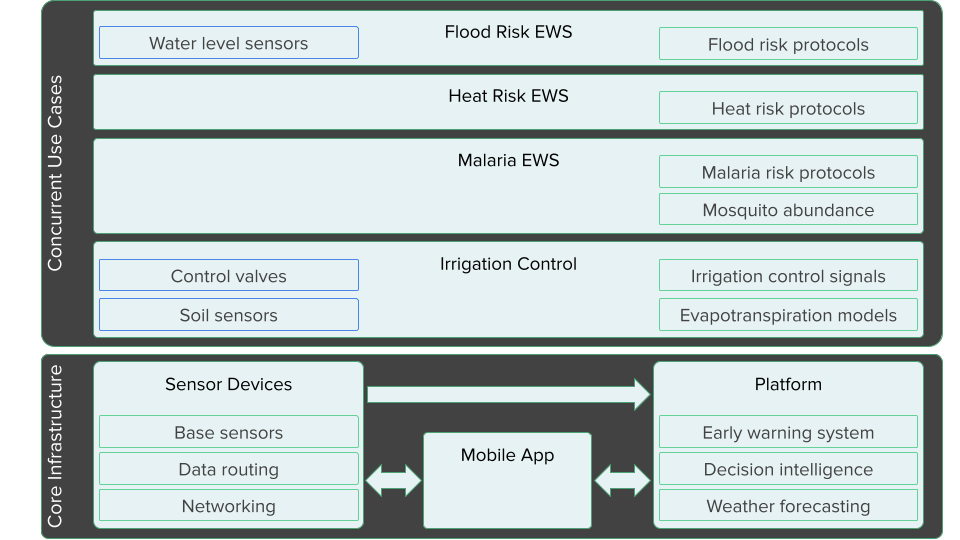
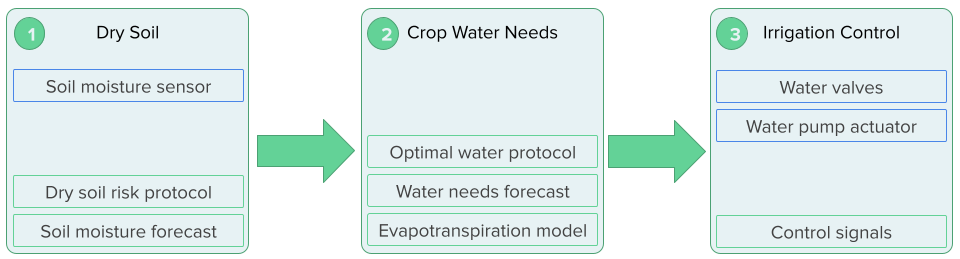
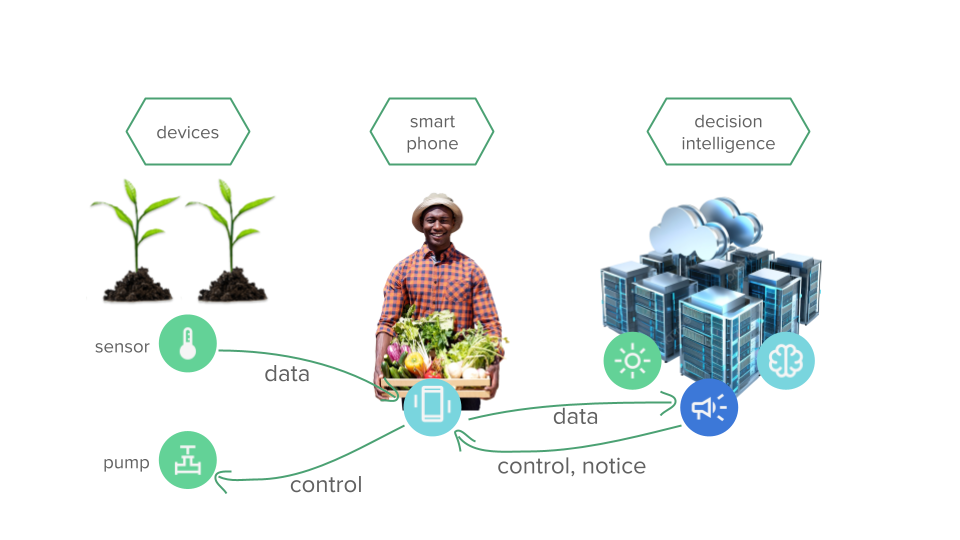

# Use Cases
Every device powers multiple simultaneous use cases.
We call this use case stacking.
This is different from re-using or re-purposing a device.
With use case stacking, multiple applications run concurrently.
The supported use cases depend on the sensors attached.
The two main public health use cases only need the base set of sensors,
which means anybody with an account can get hyperlocal heat risk
and mosquito abundance information.


```{r, echo=FALSE, out.width="1024px", fig.align='center', fig.cap="The CADP provides a common infrastructure that powers multiple concurrent applications. Each application can leverage the sensor data available from other applications, providing additional value."}

```

<!--
```{r, echo=FALSE, engine='tikz', out.width='90%', fig.ext='png', fig.cap='The CADP provides a common infrastructure that powers multiple concurrent use cases.'}
\begin{tikzpicture}
\node[rectangle,draw, minimum height=1cm, minimum width=4cm] (platform) at (0,0) {Platform};
\node[rectangle,draw, minimum height=1cm, minimum width=4cm] (device) at (4,0) {Devices};
\node[rectangle,draw, minimum height=2cm, minimum width=8cm] (apps) at (2,1.5) {};

\node[rectangle,draw, minimum height=.6cm, minimum width=7.6cm] (use1) at (2,0.9) {irrigation control};
\node[rectangle,draw, minimum height=.6cm, minimum width=7.6cm] (use2) at (2,1.5) {malaria EWS};
\node[rectangle,draw, minimum height=.6cm, minimum width=7.6cm] (use3) at (2,2.1) {heat risk EWS};
\end{tikzpicture}
```
-->


```{r, echo=FALSE, fig.align='center', fig.cap="A prototype weather station device deployed at the University of Dar es Salaam test farm in Tanzania."}
knitr::include_graphics('images/IMG_20240223_015836.jpg')
```


## Public health

### Early warning systems

The genesis of this project was the death of 11,000 people in Libya due
to a medicane (Mediterranean hurricane) that caused a dam to fail.
People were caught off guard because as a failed state,
Libya has no functioning weather agency.
It turns out that most of Africa has limited weather stations.
Most official weather agencies only send out seasonal forecasts.

Weather forecasts give people critical time to plan and prepare for
major weather events.
Building on top of weather forecasts are early warning systems (EWS).
These systems apply rules, or risk protocols, to forecasts to determine
the level of risk people are exposed to.
EWSes can operate on any type of forecast and includes heat risk,
air quality risk, the spread of wildfire,
the spread of infectious disease, and the spread of pests like the ash borer.

The UN declared a mandate that everyone should be covered by an early warning
system by 2030. Some $3 billion dollars have been earmarked for this effort.
While many countries have early warning systems, many are outdated, 
no longer work, or cover a limited number of risks.

The CADP provides the infrastructure to quickly build EWSes and fulfill
the UN's vision.

### Heat risk

Survivability is the upper limit of temperature and humidity that humans
can withstand. Humidity has a significant impact on the maximum temperature
that humans can survive in. With high humidity, the body loses its ability
to regulate temperature via perspiration.

In some places, climate change is making heat waves more extreme and pushing
temperatures to the survivability level.
Even if that limit isn't reached, whether those conditions are livable is
another matter.
Livability limits help people understand what activities are possible
given temperature and humidity (and sun exposure).
Figure \@ref(fig:livability-limits) 
compares livability limits for two population
groups and whether the activity takes place in direct sun or shade.

```{r livability-limits, echo=FALSE, fig.align='center', fig.cap="Livability limits for different METs at different temperature and humidity levels. Source: [@vanos2023]"}
knitr::include_graphics('images/livability_limits.png')
```

The conversion formula between METs ($M$) and calories is
\begin{align}
M \frac{3.5 m}{200} = kcal/min,
\end{align}
where $m$ is mass in kilograms.
This formula enables us to customize the heat risk of specific activities
according to each individual and their specific health conditions.


Heat risk builds on the concept of livability. 
The goal is to provide an EWS that helps people understand their heat risk
exposure and make decisions about what activities to do or 
how to mitigate heat risk during certain activities.
As shown in \@ref(fig:cadp-ews-quebec) the platform currently highlights
risks

```{r cadp-ews-quebec, echo=FALSE, fig.align='center', fig.cap="A screenshot of a policy dashboard showing active heat risk alerts for two devices."}
knitr::include_graphics('images/cadp_ews_quebec.png')
```

Individuals can get personalized heat risk guidance for any device in CADP.
Alerts can be delivered via email or via the mobile app.
Users can enter some health information to get better alerts.
This information is saved but 
segregated from personally identifiable information (PII).

Relevant health information includes

- age
- BMI (weight + height)
- diabetes
- heart issues

We envision a conversational alert message that doubles as a daily planner.
Integrating this information with preferred activities results in specific
messaging that informs people of what activities are realistic for a given 
day. On a very hot and humid day, an older person may want to 
limit sun exposure to an hour. That might mean that golf should be avoided,
whereas a stroll through a shaded park is more appropriate.


### Mosquito-borne infectious disease

Mosquitos are a common disease vector and 
can carry numerous infectious diseases,
such as malaria, dengue fever, zika virus, yellow fever.
Disease outbreaks are driven by the growth of a mosquito population.
To limit the severity of an outbreak,
mosquito surveillance is conducted to monitor the spread of mosquitos.
By tracking mosquito abundance, it is possible to predict how large an
outbreak might be.

Direct observation of mosquitos is an involved process. 
It requires specialized devices to attract and trap mosquitos.
Usually these devices need periodic cleaning.

A simpler approach is to use a mosquito abundance model and 
build risk protocols on that model.
These can be calibrated with physical traps (future).
Figure \@ref(fig:mosquito-abundance-pdes) shows a system of 
partial differential equations (PDEs) that describe the change
in mosquito abundance given a few parameters.
Of importance is that both temperature and humidity drive the
population growth of mosquitos.

```{r mosquito-abundance-pdes, echo=FALSE, fig.align='center', fig.cap="A system of partial differential equations that model mosquito population growth based on environmental conditions. Source: [@erraguntla2021]"}
knitr::include_graphics('images/mosquito_abundance_pdes.png')
```

We can thus use the temperature and humidity forecasts available in the CADP
to make mosquito abundance forecasts.
Figure \@ref(fig:cadp-device) shows a graph of a device in the CADP.
The green line represents observational data, 
while the orange time series is the forecast produced by the CADP.

```{r cadp-device, echo=FALSE, fig.align='center', fig.cap="A device detail view showing historical temperature, a temperature forecast, plus heat risk thresholds."}
knitr::include_graphics('images/cadp_device.png')
```


\begin{enumerate}
\item Install device in observation area
\item Enable mosquito abundance alerts
\end{enumerate}


## Precision agriculture

Helping farmers increase food security in Africa was the genesis of this project.
Optimizing water used for irrigation is one way that precision agriculture can
increase food security.
Unfettered irrigation has emptied aquifers across the world.
When aquifers are depleted, rainfall becomes a more prominent source of water.
Areas that rely on rainwater for irrigation are particularly threatened by changing climates.

Minimizing water usage also improves public health.
Many areas rely on rain water as their primary potable water source.
That means irrigation is often competing with personal hydration for water.
Optimizing water usage means there can be sufficient water for both needs.

```{r, echo=FALSE, fig.align='center', fig.cap="UDSM professors and agronomy staff standing behind a prototype weather station device."}
knitr::include_graphics('images/IMG_20240220_013145.jpg')
```

Our goal is to make precision agriculture accessible to smallholder farmers 
worldwide.
We accomplish this by making the technology easy to use and affordable.
To simplify the deployment process and ensure success,
irrigation control can be divided into three milestones that build on each
other.
Illustrated in \@ref(fig:cadp-irrigation-control),
the first stage is signaling when there will be dry soil.
The goal is to ensure plants do not dry out.
This step is good to get comfortable with the forecasting accuracy of the
system and develop confidence that it behaves correctly.
Just a single device with a soil moisture sensor is required.
It can be placed in a garden bed that gets fairly even watering.

In the second stage, an evapotranspiration model is applied to the 
device data.
Evapotranspiration models are crop specific and determine the amount of water
a plant loses due to evaporation (from soil) and transpiration (from leaves).
By incorporating this model, plants can receive the optimal amount of water
they need, not just prevent dry conditions.
There should be noticeable improved yield at this stage.
This step requires one device per crop.

The final stage brings water control into the system.
The first two stages still require human intervention to actually water
plants.
The final stage is nearly fully automated,
with the exception of the water source.
(With additional sensors,
the system can prevent pumping if no water is available.)
In addition to a water source,
stage 3 requires along with a pump, tubing, and water valves.
Water flow meters can also be added to monitor the water usage.

Automated irrigation control removes the guesswork of watering.
With continuous monitoring the system knows how much water is available
to the plant.
Using the integrated evapotranspiration models and sensor data,
the system knows how much water plants need and can provide that precise
amount.
The end result is optimal growing conditions that can improve yield
while reducing the work required to manage the crops.


```{r cadp-irrigation-control, echo=FALSE, out.width="1024px", fig.align='center', fig.cap="Precision irrigation control can be phased in over three key stages. In the first stage, a single device can monitor a garden. In the second stage, one device should be allocated per crop. In the final stage, pumps and valves are added to control water supply to individual crops."}

```


### Dry soil forecasting

Forecasting dry soil is the first step in irrigation control.
Soil that is either too dry or too wet can be harmful to plants.
While the optimal amount of water is specific to each plant,
preventing over and underwatering can be accomplished simply by monitoring
soil moisture.

A soil moisture forecast can notify the farmer or gardener when soil needs
watering.
By waiting for a watering signal, this approach avoids overwatering,
which conserves water.

The deployment model shown in Figure \@ref(fig:precision-ag-1) is relatively
simple. A single sensor device is required that has a soil moisture sensor
attached to it.

```{r precision-ag-1, echo=FALSE, fig.align='center', fig.cap="A simple installation where a single device monitors soil moisture for a crop."}
knitr::include_graphics('images/precision_ag_1.png')
```

### Crop water needs

Watering depends on the type of plant growing. Some plants need a lot of water while others don’t. Many plants don’t like wet roots, so watering cannot be too frequent. We need to develop these control models for each plant.

Water needs change based on the maturity of the plant. Beans need moist soil when pods are forming. To form large roots, beets need minimal water during early growth stages to promote root development.

We can extract this data from various agricultural sites, such as the Farmers Almanac. The information needs to be encoded into programmatic rules.

Crop calendars show the planting season and duration for different regions.

```{r, echo=FALSE, fig.align='center', fig.cap="Crop calendars for Kenya. Source: [@usda1]"}
knitr::include_graphics('images/eafrica_ke_calendar.png')
```

We use the approach defined by @brouwer1986 that determines water need
based on evapotranspiration $ET_o$ and a crop factor $K_c$.
Evapotranspiration tells us how much water is transferred to the atmosphere.
We can use these models to estimate how much water plants need to stay healthy.
By combining these models with our sensor data,
we can minimize the amount of water needed for irrigation. 


TODO: Incorporate information from this webpage:
https://www.fao.org/4/s2022e/s2022e07.htm#3.2.4%20determination%20of%20crop%20factors


Knowing whether soil needs irrigation depends on a few factors. First, the crop determines the general watering schedule. Decisions are made based on reconciling watering needs with current environmental conditions. We need to know the current soil moisture level. We also want to know the future soil moisture level, which factors in weather forecasts. There’s no point watering today if it will rain tomorrow.

### Irrigation control
Automated irrigation control builds on top of the water needs forecasting model.

```{r precision-ag-2, echo=FALSE, fig.align='center', fig.cap="A more sophisticated system with a separate device that controls an irrigation pump."}

```

### Freeze warnings

Farmers and gardeners in temperate or similar climates
need to know when there are frosts that could damage fragile seedlings.
Uncertainty leads to wasted time preparing for non-events or 
stress worrying about whether plants will be okay.

Crop tables typically show temperature ranges that specific crops can tolerate.

```{r, echo=FALSE, fig.align='center', fig.cap="Planting guides for different vegetables"}
knitr::include_graphics('images/crop_temperature_guide.jpg')
```

## Hotter Times

This site is used to display public data related to the sensor network.
Hotter Times thus becomes a public service where everyone can benefit from
the device network.

All of the layers discussed above can be displayed on Hotter Times.

