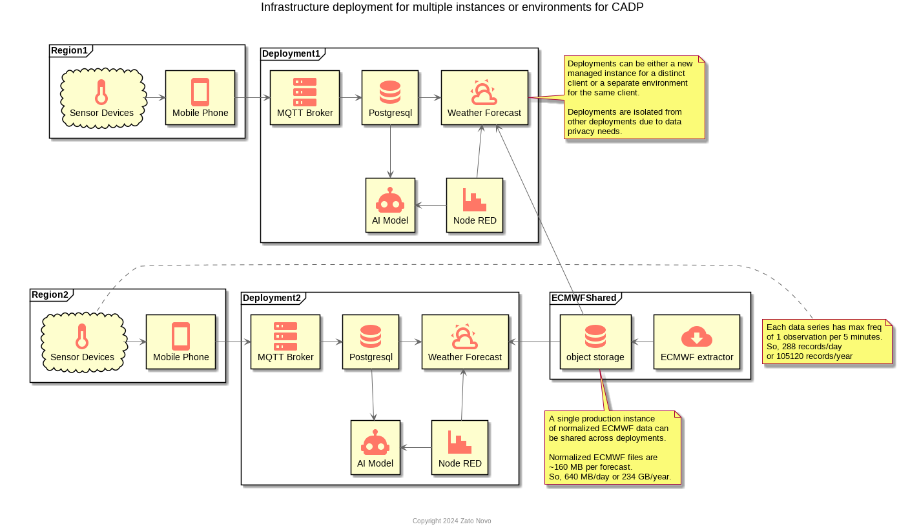

# CADP Architecture
The architecture of the CADP comprises:

- a low power and long range sensor devices;
- a data collection and storage facility;
- a pluggable predictive models for producing forecasts and predictions;
- a reporting dashboard for decisionmakers and policymakers; and
- a delivery mechanism to provide alerts and suggested interventions to individual stakeholders.


```{r infrastructure-deployments, echo=FALSE, fig.align='center', fig.cap="System architecture to generate weather forecasts and monitor devices."}

```

The system has two primary sources of data. The first is baseline
weather forecast data, produced by the European Center for Medium-range
Weather Forecasts (ECMWF).
This is a global, gridded dataset with 0.4 degree resolution.
These forecasts are archived in Amazon S3 and are publicly accessible.

The second dataset comes from the devices themselves. The sensor data is
used to tune the gridded forecast according to local conditions.

## Design principles

- Plan for 18 month shelf life
- Focus on end-to-end infrastructure
- Stub components where necessary
- Use concurrency where appropriate to minimize wall time
- Minimize data movement
- Minimize cost


## Database

## Sensor data ingestion

### Raw sensor data

Stored as an unnormalized delimited file.
These files have no header, and each row is self-contained.

The general format of the file is `key,timestamp,values`,
where `values` represents an arbitrary number of additional fields.

For example, the following snippet shows actual sensor data in this format.

```
air_t_h_p,2024-01-15T00:03:26,-5.34,85.30,1048.80
battery,2024-01-15T00:08:23,0.8398108
air_t_h_p,2024-01-15T00:13:20,-5.19,83.84,1049.22
air_t_h_p,2024-01-15T00:23:15,-5.11,82.51,1049.31
battery,2024-01-15T00:28:12,0.8361486
air_t_h_p,2024-01-15T00:33:09,-6.98,83.39,1049.73
air_t_h_p,2024-01-15T00:43:03,-6.97,82.98,1050.29
battery,2024-01-15T00:48:00,0.8359045
air_t_h_p,2024-01-15T00:52:57,-6.99,84.48,1050.52
air_t_h_p,2024-01-15T00:57:44,-5.05,84.28,1050.53
battery,2024-01-15T01:02:44,0.8312657
air_t_h_p,2024-01-15T01:02:45,-6.87,84.85,1050.91
air_t_h_p,2024-01-15T01:12:39,-5.05,84.56,1050.78
air_t_h_p,2024-01-15T01:22:33,-5.06,84.41,1051.12
battery,2024-01-15T01:22:34,0.8307775
air_t_h_p,2024-01-15T01:32:28,-6.99,83.29,1051.41
air_t_h_p,2024-01-15T01:42:22,-6.87,82.33,1051.89
battery,2024-01-15T01:42:22,0.8363928
air_t_h_p,2024-01-15T01:52:16,-6.61,80.60,1052.68
air_t_h_p,2024-01-15T02:01:55,-6.27,80.06,1053.42
battery,2024-01-15T02:01:56,0.831754
air_t_h_p,2024-01-15T02:11:50,-6.34,77.78,1053.46
air_t_h_p,2024-01-15T02:21:44,-6.39,76.10,1053.47
battery,2024-01-15T02:21:45,0.8322423
air_t_h_p,2024-01-15T02:31:39,-6.17,73.03,1053.98
air_t_h_p,2024-01-15T02:41:33,-6.08,71.05,1054.36
battery,2024-01-15T02:41:33,0.8361486
```

Two observation types are included. The first is `air_t_h_p`,
which represents air observations.
The key hints that there are three value fields.
The second observation type is `battery` and contains a single reading 
for the battery level.

### Data issues
When the device cannot connect to the Internet for a while, it loses it's
internal time, and the clock resets to 2000-01-01.
These data points can be dropped.

Even if the clock doesn't reset, there can be clock drift.
This can usually be ignored since the observations are aggregated anyway.

## Weather forecasting

The system uses the ECMWF global gridded forecast data as a baseline forecast.
Local sensor data is integrated into this forecast to produce a more
accurate forecast for specific locations.

### ECMWF forecasts

ECMWF forecasts are updated every six hours. The publicly available AWS
archive\footnote{\url{https://registry.opendata.aws/ecmwf-forecasts/}}
has a complete history of data.
Usage for the bash script that downloads the data appears in Appendix A.

There are up to 48 forecast steps per forecast.
Each forecast step ranges between 27 MB - 50 MB,
which implies a minimum of 1.3 GB of data is
retrieved every six hours (per update).
To save space, these files need to be slimmed down
by removing all unnecessary data.

## Early warning system
